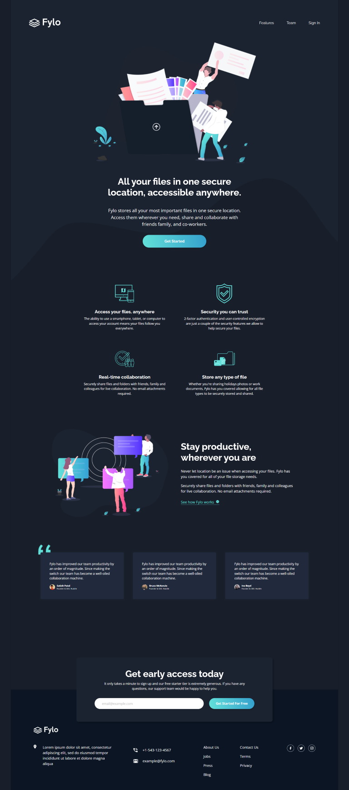

# Frontend Mentor - Fylo dark theme landing page solution

This is a solution to the [Fylo dark theme landing page challenge on Frontend Mentor](https://www.frontendmentor.io/challenges/fylo-dark-theme-landing-page-5ca5f2d21e82137ec91a50fd). Frontend Mentor challenges help you improve your coding skills by building realistic projects.

## Table of contents

- [Overview](#overview)
  - [The challenge](#the-challenge)
  - [Screenshot](#screenshot)
  - [Links](#links)
- [My process](#my-process)
  - [Built with](#built-with)
  - [What I learned](#what-i-learned)
  - [Continued development](#continued-development)
- [Author](#author)

## Overview

### The challenge

Users should be able to:

- View the optimal layout for the site depending on their device's screen size
- See hover states for all interactive elements on the page

### Screenshot

### Links

- Solution URL: [Solution](https://github.com/socratesioa/fylo-dark-theme-landing-page)
- Live Site URL: [Live Site](https://socratesioa.github.io/fylo-dark-theme-landing-page)

## My process

### Built with

- Semantic HTML5 markup
- CSS custom properties
- Flexbox
- CSS Grid
- Mobile-first workflow
- JavaScript
- Dart Sass (https://sass-lang.com/dart-sass)

### What I learned

I used this challenge to practice Sass. It was very helpful as this challenge provided a few challenges with the layout shifts.

### Continued development

As with every challenge I do I try to improve a bit on something. In this one, the layout shifts were a bit challenging but I managed to work through them methodically. Also improved my form validation skills.

## Author

- Website - [My Portfolio](https://portfolio.thisissocrates.com/)
- Frontend Mentor - [@socratesioa](https://www.frontendmentor.io/profile/socratesioa)
